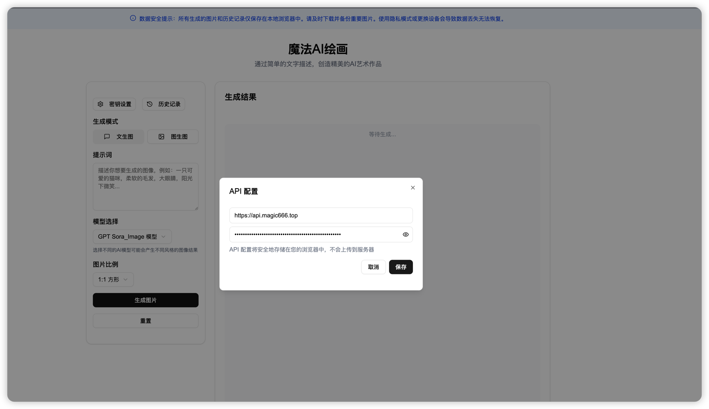
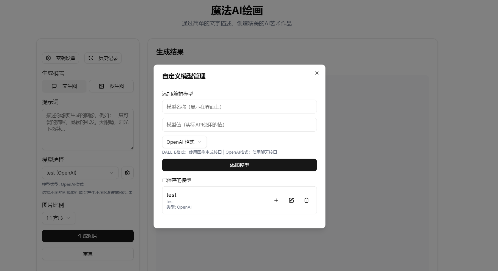
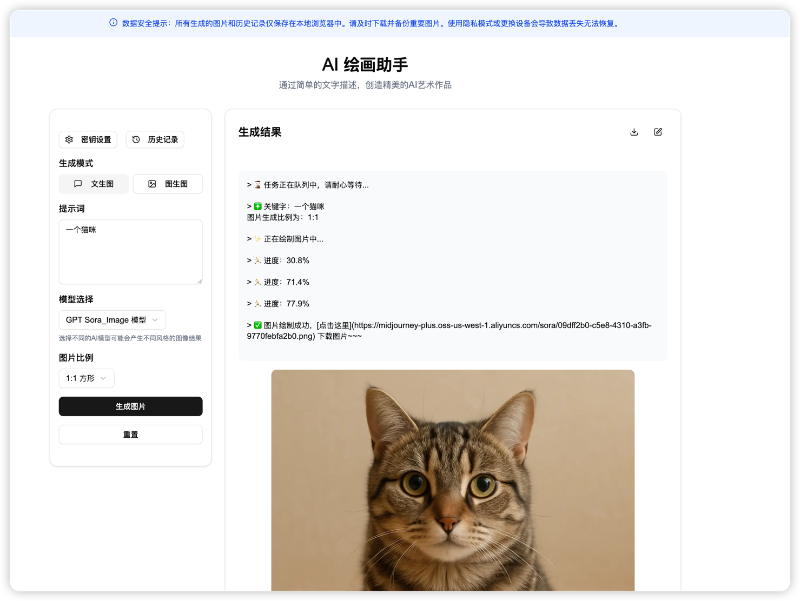
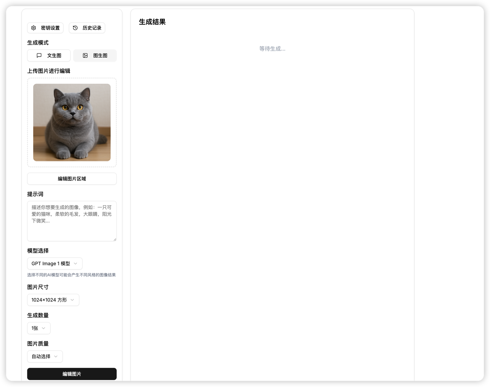
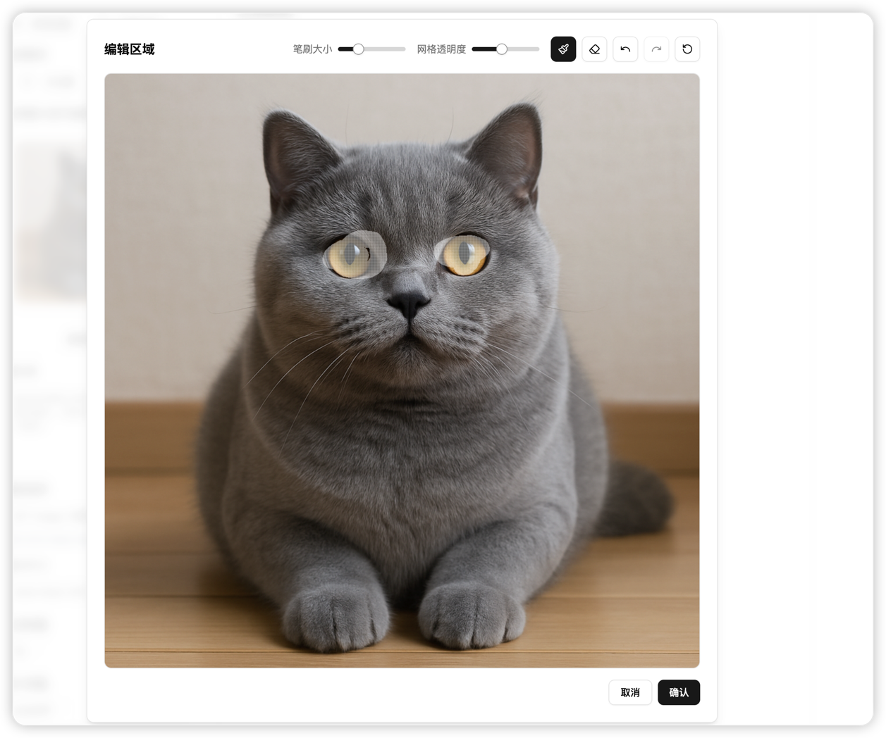

# 魔法AI绘画

<div align="right">中文 | <a href="README-EN.md">English</a></div>

[](https://opensource.org/licenses/Apache-2.0)
[](https://nextjs.org/)
[](https://www.typescriptlang.org/)
[](https://tailwindcss.com/)

一个基于 Next.js 开发的 AI 绘画应用，具有以下主要功能：
- 🎨 支持多种 AI 模型（Sora、DALL-E、GPT等）及自定义模型添加
- 🖼️ 提供文生图和图生图功能，支持多图参考和区域编辑
- 🔐 所有数据和API密钥本地存储，保障隐私安全
- 💻 支持网页版及桌面应用打包，跨平台使用

## 在线体验

访问地址：[https://image-front-eight.vercel.app/](https://image-front-eight.vercel.app/)

### 应用截图

<div align="center">
  
      
  
  
  
</div>

## 功能特点

- 🎨 支持多种 AI 模型
  - GPT Sora_Image 模型
  - GPT 4o_Image 模型
  - GPT Image 1 模型
  - DALL-E 3 模型
  - 🆕 自定义模型（支持添加私有模型）
- ✍️ 文生图功能
  - 支持自定义提示词
  - 可选择图片比例
  - 支持多种图片尺寸
- 🖼️ 图生图功能
  - 支持图片编辑
  - 支持区域遮罩编辑
  - 支持图片质量调整
  - 支持多图参考（同时上传多张图片）
- 🔒 数据安全
  - 所有生成的图片和历史记录仅保存在本地浏览器中
  - 支持自定义 API 代理地址
  - 支持 API Key 配置
- 📱 UI设计
  - 现代化的用户界面
  - 流畅的交互体验
  - Markdown 格式展示
  - 代码高亮支持
- 🖥️ 跨平台支持
  - 支持打包为桌面应用（Windows、macOS、Linux）
  - 支持离线使用（需要配置API接口）

## 技术栈

- Next.js 14
- TypeScript
- Tailwind CSS
- shadcn/ui
- React
- Tauri (桌面应用打包)

## 本地开发

1. 克隆项目
```bash
git clone https://github.com/HappyDongD/magic_image.git
cd magic_image
```

2. 安装依赖
```bash
npm install
# 或
yarn install
# 或
pnpm install
```

3. 启动开发服务器
```bash
npm run dev
# 或
yarn dev
# 或
pnpm dev
```

4. 访问 [http://localhost:3000](http://localhost:3000)

## 桌面应用打包

本项目使用 Tauri 进行桌面应用打包，支持 Windows、macOS 和 Linux 系统。

### 环境准备

在打包桌面应用前，需要安装以下依赖：

1. **安装 Rust**：
   - 访问 [https://www.rust-lang.org/tools/install](https://www.rust-lang.org/tools/install)
   - 按照指引安装 Rust 和 Cargo

2. **系统依赖**：
   - **Windows**: 安装 [Visual Studio C++ 构建工具](https://visualstudio.microsoft.com/visual-cpp-build-tools/)
   - **macOS**: 安装 Xcode 命令行工具 (`xcode-select --install`)
   - **Linux**: 安装相关依赖，详见 [Tauri 文档](https://tauri.app/v1/guides/getting-started/prerequisites)

### 开发模式

```bash
# 安装 Tauri CLI
npm install -D @tauri-apps/cli

# 启动桌面应用开发模式
npm run tauri:dev
```

### 构建桌面应用

```bash
# 构建桌面应用安装包
npm run desktop
```

构建完成后，可以在 `src-tauri/target/release/bundle` 目录找到对应系统的安装包。

## Vercel 部署

1. Fork 本项目到你的 GitHub 账号

2. 在 [Vercel](https://vercel.com) 上创建新项目

3. 导入你的 GitHub 仓库

4. 点击部署

## 使用说明

1. 首次使用需要配置 API 密钥
   - 点击右上角的"密钥设置"
   - 输入 API 密钥和基础地址
   - 点击保存
   - 也可以通过 URL 参数快速配置：
     ```
     http://localhost:3000?url=你的API地址&apikey=你的API密钥
     ```
     例如：
     ```
     http://localhost:3000?url=https%3A%2F%2Fapi.example.com&apikey=sk-xxx
     ```
     注意：URL 中的特殊字符需要进行 URL 编码

2. 选择生成模式
   - 文生图：通过文字描述生成图片
   - 图生图：上传图片进行编辑

3. 设置生成参数
   - 选择 AI 模型（内置模型或自定义模型）
   - 设置图片比例
   - 调整图片质量（图生图模式）

4. 自定义模型管理
   - 点击模型选择框旁边的设置图标
   - 添加新模型：输入模型名称、模型值和选择模型类型
   - 编辑模型：点击已有模型的编辑按钮
   - 删除模型：点击已有模型的删除按钮
   - 选择模型：点击模型的加号按钮立即选择使用该模型

5. 模型类型说明
   - DALL-E 格式：使用图像生成接口（/v1/images/generations）
   - OpenAI 格式：使用聊天接口（/v1/chat/completions）

6. 生成图片
   - 输入提示词
   - 点击"生成图片"按钮
   - 等待生成完成

7. 图片管理
   - 查看历史记录
   - 下载生成的图片
   - 编辑已有图片

## 注意事项

- 所有生成的图片和历史记录仅保存在本地浏览器中
- 使用隐私模式或更换设备会导致数据丢失
- 请及时下载并备份重要图片
- API 配置将安全地存储在您的浏览器中，不会上传到服务器
- HTTPS 网站加载 HTTP 资源会被浏览器阻止，应用会自动将 HTTP 接口转换为 HTTPS

## 贡献指南

欢迎提交 Issue 和 Pull Request 来帮助改进项目。

## 许可证

本项目采用 [Apache License 2.0](https://www.apache.org/licenses/LICENSE-2.0) 许可证。

根据许可证，您可以：
- ✅ 商业用途：可以将软件用于商业用途
- ✅ 修改：可以修改软件源代码
- ✅ 分发：可以分发软件
- ✅ 私人使用：可以私人使用软件
- ✅ 专利授权：本许可证还提供了专利授权

但必须遵守以下条件：
- 📝 许可和版权声明：您必须包含原始的许可证和版权声明
- 📝 声明更改：您必须声明对原始代码的重大更改
- 📝 商标声明：不得使用贡献者的商标

---

## 请我喝杯咖啡

如果这个项目对你有帮助，欢迎请我喝杯咖啡 ☕️

<div align="center">
  
  <p>请我喝杯咖啡</p>
</div>

## 联系方式

如果您有任何问题或建议，欢迎通过微信联系我：

<div align="center">
  
  <p>扫描二维码添加微信</p>
</div>

